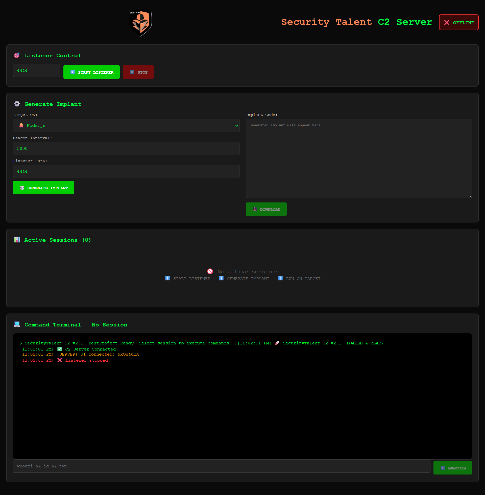

# Security Talent Command and Control (C2) Server

SecurityTalent C2 is a modern, cross-platform Command & Control (C2) framework designed for authorized penetration testing and red team operations. Built with Socket.IO for real-time communication, it supports multiple implant types (Node.js, PowerShell, Bash/Linux) with beaconing capabilities.



# 🎯 Features
- Multi-platform implants: Node.js, PowerShell, Bash/Linux
- Real-time session management with automatic beaconing
- Interactive web-based terminal with command execution
- Persistent listeners with auto-reconnection
- Session persistence tracking (PID, IP, architecture, last seen)
- One-click implant generation & download
- Live server logging and status monitoring


> **⚠️ Warning:** Command and Control (C2) is still in an experimental stage, more advanced and powerful versions will be released in the future.


# 🛠️ Architecture

```bash
C2 Server (Node.js + Socket.IO)
    ├── Web Dashboard (HTML/CSS/JS)
    ├── Listener Engine (TCP/WebSocket)
    └── Implant Handlers (Node/PowerShell/Bash)
```

## Requirements

- Node.js 18+ recommended
- npm
- A private, isolated, and authorized test environment

## Installation
```bash
git clone https://github.com/SecurityTalent/Security-Talent-C2-Server.git
cd Security-Talent-C2-Server
```

```bash
npm install
```

## Running The Server

Development mode:

```bash
npm run dev
```

Production mode:

```bash
npm start
```
START LISTENER → GENERATE IMPLANT → DEPLOY ON TARGET


# 🎮 Usage Workflow
```bash
1️⃣ START LISTENER (port 4444)
   └─ TCP listener awaits incoming implants

2️⃣ GENERATE IMPLANT
   ├─ Select target OS (Node.js/PowerShell/Bash)
   ├─ Set beacon interval (default: 5s)
   └─ DOWNLOAD generated payload

3️⃣ DEPLOY IMPLANT on target
   └─ Implant auto-connects & creates session

4️⃣ INTERACTIVE SESSION
   ├─ Click session to select
   └─ Execute commands in real-time terminal
```


## Disclaimer
Use this code for Educational Purpose only.

# 🆘 Support
- GitHub Issues
- [Facebook](https://www.facebook.com/Securi3ytalent)
- [Telegram](https://t.me/Securi3yTalent)